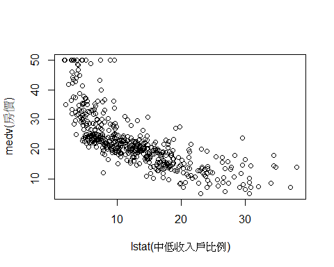

03-11 Linear Regression
================
Li-Hsin Chien
2024-03-10

- [1 引入 R 套件(R package)](#1-引入-r-套件r-package)
- [2 簡單線性回歸 Simple Linear
  Regression](#2-簡單線性回歸-simple-linear-regression)
  - [2.1 模型 Model](#21-模型-model)
  - [2.2 參數估計 Estimation](#22-參數估計-estimation)
  - [2.3 用 R 估計簡單線性迴歸模型](#23-用-r-估計簡單線性迴歸模型)
    - [2.3.1 係數點估計值](#231-係數點估計值)
    - [2.3.2 標準差估計值](#232-標準差估計值)
    - [2.3.3 統計推論:
      假設檢定、信賴區間](#233-統計推論-假設檢定信賴區間)

這部分的內容可以參考課本 3.6 節。

# 1 引入 R 套件(R package)

這本書所用到的資料大都放在 R 套件 *ISLR2* 裡，*MASS* 套件是 R 內建套件
(不用另外安裝)，*MASS* 中亦包含很多資料集。

- *install.packages()*: 安裝套件指令
- *library()*: 引入套件指令

``` r
#install.packages("ISLR2")
#library(MASS)
library(ISLR2)
```

# 2 簡單線性回歸 Simple Linear Regression

## 2.1 模型 Model

簡單線性模型 (Simple linear regression) 模型如下:
$$ y = \beta_0 + \beta_1 x + \varepsilon $$ 我們假設
$$E(\varepsilon)=0, Var(\varepsilon)=\sigma^2$$ 需要估計的模型參數有:
模型係數 $(\beta_0,\beta_1)$, 誤差項變異數 $\sigma^2$。

## 2.2 參數估計 Estimation

假設我們收集了 $n$ 個隨機樣本 (random sample):
$(x_1,y_1),(x_2,y_2),...,(x_n,y_n)$。

模型係數 $(\beta_0,\beta_1)$ 的估計採用最小平方法 (OLS, ordinary least
squares)。 OLS 得到的 $(\hat{\beta}_0,\hat{\beta}_1)$
會使得樣本的誤差平方和最小

$$ (\hat{\beta}_0,\hat{\beta}_1) = arg \min_{\beta_0,\beta_1} \left\{ \sum_{i=1}^n[y_i-(\beta_0+\beta_1x_i)]^2\right\}$$

我們可以得到係數的點估計結果

$$ \hat{\beta}_0 = \bar{y}-\hat{\beta}_1\bar{x} $$

$$ \hat{\beta}_1 = \frac{\sum_{i=1}^n[(x_i-\bar{x})(y_i-\bar{y})]}{\sum_{i=1}^n (x_i-\bar{x})^2} $$

以及估計值的變異數

$$ Var(\hat{\beta}_0)=\sigma^2(\frac{1}{n}+\frac{\bar{x}^2}{\sum_{i=1}^n (x_i-\bar{x})^2}) $$

$$ Var(\hat{\beta}_1)=\frac{\sigma^2}{\sum_{i=1}^n (x_i-\bar{x})^2}$$
變異數中有未知參數 $\sigma^2$，其不偏估計量為

$$\hat{\sigma}^2=\frac{RSS}{n-2}=\frac{\sum_{i=1}^n e_i^2}{n-2}$$ $e_i$
為殘差
(residuals)，$e_i=y_i-\hat{y}_i=y_i-\hat{\beta}_0-\hat{\beta}_1x_i$.

將未知的 $\sigma^2$ 用 $\hat{\sigma}^2$ 取代，則可得到
$\hat{\beta}_0,\hat{\beta}_1$ 變異數 (Variance) 的估計量:

$$ \hat{Var}(\hat{\beta}_0)=\hat{\sigma}^2(\frac{1}{n}+\frac{\bar{x}^2}{\sum_{i=1}^n (x_i-\bar{x})^2}) $$

$$ \hat{Var}(\hat{\beta}_1)=\frac{\hat{\sigma}^2}{\sum_{i=1}^n (x_i-\bar{x})^2}$$

以下將以*Boston*資料，用 R 得出上述的簡單線性回歸模型估計結果。

## 2.3 用 R 估計簡單線性迴歸模型

*Boston*資料在 *ISLR2* 套件內，引入 *ISLR2*
套件(*library(ISLR2)*)後，便可輸入 *Boston* 讀取資料。

``` r
head(Boston) #查看前 6 筆樣本內容
```

    ##      crim zn indus chas   nox    rm  age    dis rad tax ptratio lstat medv
    ## 1 0.00632 18  2.31    0 0.538 6.575 65.2 4.0900   1 296    15.3  4.98 24.0
    ## 2 0.02731  0  7.07    0 0.469 6.421 78.9 4.9671   2 242    17.8  9.14 21.6
    ## 3 0.02729  0  7.07    0 0.469 7.185 61.1 4.9671   2 242    17.8  4.03 34.7
    ## 4 0.03237  0  2.18    0 0.458 6.998 45.8 6.0622   3 222    18.7  2.94 33.4
    ## 5 0.06905  0  2.18    0 0.458 7.147 54.2 6.0622   3 222    18.7  5.33 36.2
    ## 6 0.02985  0  2.18    0 0.458 6.430 58.7 6.0622   3 222    18.7  5.21 28.7

``` r
dim(Boston)  #查看資料筆數
```

    ## [1] 506  13

這筆資料總共有 506 rows & 13 columns，代表有 506 個樣本，13 個變數。

``` r
?Boston      #在 help 視窗顯示資料內容  
```

    ## 開啟 httpd 求助伺服器… 好了

由 help 的內容可知，這筆資料收集波士頓(Boston) 區域 506 個郊區 (suburb)
的房價:

- Description: A data set containing housing values in 506 suburbs of
  Boston.

我們分析採用的變數為:

- medv ($y$): median value of owner-occupied homes (in 1000s USD).
  郊區房價的中位數 (單位為 1000 美金)
- lstat ($x$): lower status of the population (percent).
  中低收入戶佔當地居住人口的比例 (用百分比表示)

我們可以先畫圖，觀察是否有線性關係

``` r
plot(Boston$lstat,Boston$medv, xlab="lstat(中低收入戶比例)", ylab="medv(房價)")
```

<!-- -->

線性回歸的 R 指令為 *lm*，指令如下:

``` r
lm.fit <- lm(medv~lstat, data=Boston) #將模型配適結果存入 lm.fit 中
```

``` r
lm.fit
```

    ## 
    ## Call:
    ## lm(formula = medv ~ lstat, data = Boston)
    ## 
    ## Coefficients:
    ## (Intercept)        lstat  
    ##       34.55        -0.95

``` r
summary(lm.fit)
```

    ## 
    ## Call:
    ## lm(formula = medv ~ lstat, data = Boston)
    ## 
    ## Residuals:
    ##     Min      1Q  Median      3Q     Max 
    ## -15.168  -3.990  -1.318   2.034  24.500 
    ## 
    ## Coefficients:
    ##             Estimate Std. Error t value Pr(>|t|)    
    ## (Intercept) 34.55384    0.56263   61.41   <2e-16 ***
    ## lstat       -0.95005    0.03873  -24.53   <2e-16 ***
    ## ---
    ## Signif. codes:  0 '***' 0.001 '**' 0.01 '*' 0.05 '.' 0.1 ' ' 1
    ## 
    ## Residual standard error: 6.216 on 504 degrees of freedom
    ## Multiple R-squared:  0.5441, Adjusted R-squared:  0.5432 
    ## F-statistic: 601.6 on 1 and 504 DF,  p-value: < 2.2e-16

### 2.3.1 係數點估計值

由R指令 $summary(lm.fit)$ 可知

$$ \hat{\beta}_0=34.55, \; \hat{\beta}_1=-0.95$$ 因此所估計出的模型為:

$$ \hat{y}=34.55-0.95x$$

代表在郊區內，中低收入戶的比例每增加 1%，房價減少 950 美元
(0.95\*1000)。

我們可利用 *names()* 指令找出其他 *lm.fit* 內存取的估計結果:

``` r
names(lm.fit)
```

    ##  [1] "coefficients"  "residuals"     "effects"       "rank"         
    ##  [5] "fitted.values" "assign"        "qr"            "df.residual"  
    ##  [9] "xlevels"       "call"          "terms"         "model"

``` r
names(summary(lm.fit))
```

    ##  [1] "call"          "terms"         "residuals"     "coefficients" 
    ##  [5] "aliased"       "sigma"         "df"            "r.squared"    
    ##  [9] "adj.r.squared" "fstatistic"    "cov.unscaled"

其中，$\hat{\sigma}$ 存在 *summary(lm.fit)* 中，我們可以用以下指令叫出:

``` r
summary(lm.fit)$sigma #利用 $ 叫出變數中存取的結果
```

    ## [1] 6.21576

因此， $$\hat{\sigma}=6.22$$

### 2.3.2 標準差估計值

$$ \sqrt{\hat{Var}(\hat{\beta}_0)} = 0.56, \; \sqrt{\hat{Var}(\hat{\beta}_1)}=0.04$$

### 2.3.3 統計推論: 假設檢定、信賴區間

對 $\beta_1$ 進行假設檢定 $$ H_0: \beta_1 = 0$$ $$ H_1: \beta_1 \neq 0$$

假設檢定 p-value $< 2\times 10^{-6}$，reject
$H_0$。因此我們可以得到郊區內中低收入戶的比例對該地區的房價有顯著的影響。

``` r
confint(lm.fit) #估計量信賴區間
```

    ##                 2.5 %     97.5 %
    ## (Intercept) 33.448457 35.6592247
    ## lstat       -1.026148 -0.8739505

$\hat{\beta}_0$ 的95%信賴區間為 (33.44,35.66)，$\hat{\beta}_1$
的95%信賴區間為 (-1.03,-0.87)。
